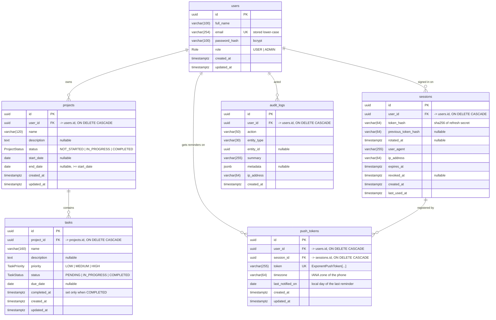

# Database

PostgreSQL 14+ (tested on 16 and 18). The schema is defined in [`backend/prisma/schema.prisma`](../backend/prisma/schema.prisma) and created by the SQL migrations in [`backend/prisma/migrations`](../backend/prisma/migrations).

The complete schema as one plain SQL file (tables, enums, indexes, foreign keys, CHECK constraints) is in **[`schema.sql`](schema.sql)**.

## ER diagram



## Design notes

- **Normalised (3NF).** A task doesn't store its owner. Ownership is held once, in `projects.user_id`, and every task query joins through the project (`WHERE project.user_id = $current_user`). A task can't end up "owned" by a different user than its project.
- **Foreign keys with cascades.** Deleting a project deletes its tasks. Deleting a user deletes their projects, tasks, sessions, push tokens and audit entries.
- **Enums are PostgreSQL enums.** `Role`, `ProjectStatus`, `TaskStatus` and `TaskPriority` are real DB types, so a bad value is rejected by the database as well as by the API. `TaskPriority` is declared low → high so `ORDER BY priority` sorts by importance.
- **Calendar dates are `DATE`, not timestamps.** Start, end and due dates have no time zone, so a due date doesn't move when viewed from another time zone.
- **CHECK constraints** (migration `integrity_checks`):
  - `projects.end_date >= projects.start_date` when both are set
  - project and task names can't be blank
  - `tasks.completed_at` is set exactly when `status = 'COMPLETED'`
  - `users.email` is lower-case (so the unique index is effectively case-insensitive)
- **Push tokens belong to a session.** A phone that opted in to reminders is tied to the sign-in that registered it. Signing out, or the session being revoked or expiring, stops reminders to that phone. `last_notified_on` holds the phone's *local* date, so each device gets at most one reminder per day, even if the job runs many times.
- **Indexes** cover the hot paths: `projects(user_id, created_at)`, `projects(user_id, status)`, `tasks(project_id, status)`, `tasks(project_id, due_date)`, `sessions(user_id)`, `audit_logs(user_id, created_at)`, plus the unique index on `users.email`.
- **No secrets in plain text.** Passwords are bcrypt hashes (cost 12). Refresh tokens are stored as SHA-256 hashes, so a database dump can't be used to sign in.

## Setup

### Option A: Docker

```bash
docker compose up -d db
```

This starts PostgreSQL 16 on `localhost:5432` with user/password/database `taskline`.

### Option B: a local PostgreSQL install

```sql
CREATE USER taskline WITH PASSWORD 'taskline' CREATEDB;
CREATE DATABASE taskline OWNER taskline;
```

`CREATEDB` lets Prisma create its temporary "shadow" database during `migrate dev`.

### Option C: a hosted database (Neon, Supabase, Render, Railway)

Create a database and paste its connection string into `DATABASE_URL`. Hosted providers usually need `?sslmode=require` at the end of the URL.

### Create the tables and test data

```bash
cd backend
cp .env.example .env          # then set DATABASE_URL
npx prisma migrate deploy     # creates every table, enum, index and constraint
npm run db:seed               # optional: two test accounts with sample projects
```

Seeded test accounts (fake data only):

| Email                | Password     | Role  |
| -------------------- | ------------ | ----- |
| `demo@taskline.dev`  | `Demo@1234`  | USER  |
| `admin@taskline.dev` | `Admin@1234` | ADMIN |

Other useful commands, run from `backend/`:

| Command              | What it does                                                    |
| -------------------- | --------------------------------------------------------------- |
| `npm run db:migrate` | Development: apply migrations and create a new one after editing `schema.prisma` |
| `npm run db:deploy`  | Production/CI: apply pending migrations only                    |
| `npm run db:reset`   | Drop everything, re-run all migrations and the seed             |
| `npm run db:studio`  | Browse the data in Prisma Studio                                |
